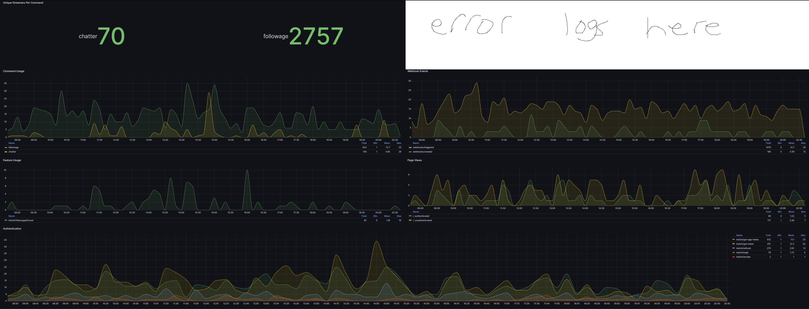

# commands.garretcharp.com

A simple api for chat bot commands on Twitch. (Followage, Random Chatters, maybe more in the future)

## Usage

Note: All endpoints currently require you login with Twitch as the APIs require moderator level permissions to the channels for the data queried. There are also better explanations of how to use this api with chatbots (nightbot) on the [website](https://commands.garretcharp.com).

### Followage

`https://commands.garretcharp.com/twitch/followage/{channel}/{user}`

Returns the followage of {user} in {channel} on Twitch.

#### Options (Query Parameters)

`moderatorId` - The id of the moderator to use for Twitch API Authentication. (Defaults to the channel owner)

`format` - The format to return the followage in. (Defaults to `ymdhis`)
- `y` - Years
- `m` - Months
- `w` - Weeks
- `d` - Days
- `h` - Hours
- `i` - Minutes
- `s` - Seconds

`ping` - Whether or not to ping the user in the response. (Defaults to true, set to `false` to not ping the user)

`lang` - Set followage message language. Currently available languages are `en` and `tr`.  (Defaults to `en`)

#### Example

`https://commands.garretcharp.com/twitch/followage/itsunsmart/acpixel`

Returns:
@acpixel has been following @itsunsmart for 3 years, 1 month, 11 days, 14 hours, 8 minutes, 8 seconds.

### Random Chatters

`https://commands.garretcharp.com/twitch/chatter/{channel}`

Returns a random chatter from {channel} on Twitch.

#### Options (Query Parameters)

`moderatorId` - The id of the moderator to use for Twitch API Authentication. (Defaults to the channel owner)

`bots` - Whether or not to include bots in the random chatter. (Defaults to false, set to `true` to include bots)

`count` - The number of chatters to return. (Defaults to 1)

#### Example

`https://commands.garretcharp.com/twitch/chatter/itsunsmart`

Returns:
acpixel

## Example Metrics Dashboard

